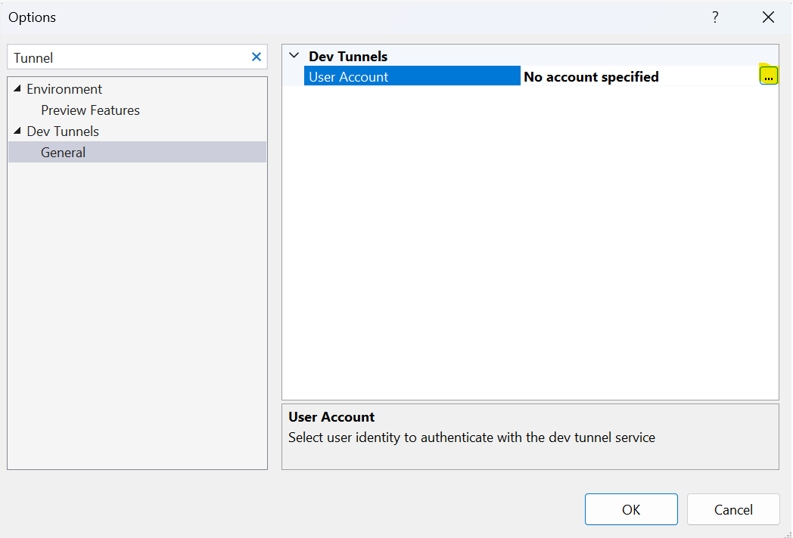

# Recording APIs Sample

This is a sample application to show how the Azure Communication Call Automation SDK can be used to build a call recording feature.

It's a C# based application powered by Dot net core to connect this application with Azure Communication Services.

A separate branch with end to end implementation is [available](https://github.com/Azure-Samples/communication-services-web-calling-hero/tree/public-preview). It's a public preview branch and uses beta SDKs that are not meant for production use. Please use the main branch sample for any production scenarios.

## Prerequisites

- Create an Azure account with an active subscription. For details, see [Create an account for free](https://azure.microsoft.com/free/?WT.mc_id=A261C142F)
- [Visual Studio (2022 and above)](https://visualstudio.microsoft.com/vs/)
- [.NET Core 7.0](https://dotnet.microsoft.com/en-us/download/dotnet/7.0) (Make sure to install the version that corresponds with your visual studio instance, 32 vs 64 bit)
- Create an Azure Communication Services resource. For details, see [Create an Azure Communication Resource](https://docs.microsoft.com/azure/communication-services/quickstarts/create-communication-resource). You'll need to record your resource **connection string** for this quickstart.
- Create dev tunnel.

### Create Webhook for Microsoft.Communication.RecordingFileStatus event

Call Recording enables you to record multiple calling scenarios available in Azure Communication Services by providing you with a set of APIs to start, stop, pause and resume recording. 
1. Navigate to your resource on Azure portal and select `Events` from the left side menu.
2. Select `+ Event Subscription` to create a new subscription. 
3. Filter for Recording File Status Updated(preview) event. 
4. Choose endpoint type as web hook and provide the public url generated for your application by Dev Tunnels. Make sure to provide the exact api route that you programmed to receive the event previously. In this case, it would be <dev_tunnel_url>/getRecordingFile.

1. Select create to start the creation of subscription and validation of your endpoint as mentioned previously. The subscription is ready when the provisioning status is marked as succeeded.

## Code structure

- ./ServerRecording/Controllers : Server app core logic for outbound call - an active call required for recording to start. call recording APIs - to perform start,pause,resume and stop events.
- ./ServerRecording/Program.cs : Entry point for the server app program logic

## Before running the sample for the first time

1. Open an instance of PowerShell, Windows Terminal, Command Prompt or equivalent and navigate to the directory that you'd like to clone the sample to.
2. git clone https://github.com/Azure-Samples/Communication-Services-dotnet-quickstarts.git.
3. Once you get the config keys add the keys to the **ServerRecording/appsetting.json**  file found under the ServerRecording folder.
	- Input your ACS connection string in the variable: `ACSResourceConnectionString`
	- Phone number associated with the Azure Communication Service resource: `ACSAcquiredPhoneNumber`
	- Base url of the app. (For local devlopment replace the dev tunnel url): `BaseUri`

## Dev Tunnel Setup

1. Go to ServerRecording folder and open `RecordingApi.csproj` solution in Visual Studio.
2. Enable Visual studio dev tunneling for local development. For details, see [Enable dev tunnel] (https://learn.microsoft.com/en-us/connectors/custom-connectors/port-tunneling)
	- To enable dev tunneling, Click `Tools` -> `Options` in Visual Studio 2022
	- In the search bar type tunnel, Click the checkbox under `Environment` -> `Preview Features` called `Enable dev tunnels for Web Application`
	-  
	- Login into your account under `Dev Tunnels` -> `General`
	-  

## Step by step swagger api calls to test locally

1. Run the 'ServerRecording' app .The Swagger UI get's open.
2. Invoke api/call under Outbound section.
3. Accept the call on provided pstn phone.
4. Get server call id from your log.
5. Then invoke recording api with the parameters "Servercallid".
6. Follow the remaining(pauseRecording,resumeRecording & stopRecording) api's to excute with the  parameters RecordingId.
7. With the StopRecording api it will stop recording and download the Audio file.The file found under the ServerRecording folder.

## Additional Reading

- [Azure Communication Calling SDK](https://docs.microsoft.com/azure/communication-services/concepts/voice-video-calling/calling-sdk-features) - To learn more about the calling web sdk
- [ASP.NET Core](https://learn.microsoft.com/en-us/aspnet/core/introduction-to-aspnet-core?view=aspnetcore-6.0) - Framework for building web applications
